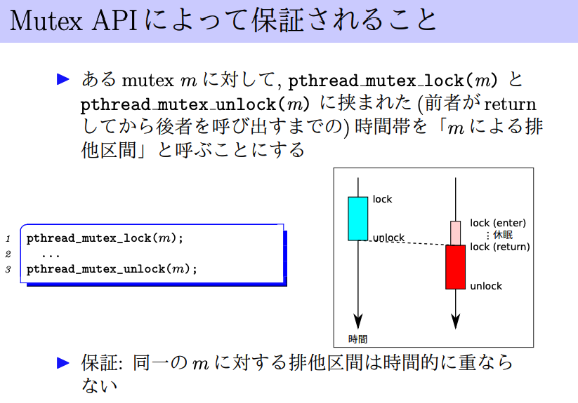
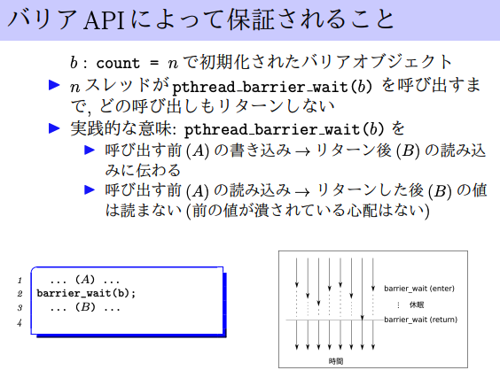

# 並行処理と同期

## 共有メモリと競合状態
### 例
同一プロセス内のスレッドはメモリを共有している。

競合する例: 2 child threads

片方のg += 100 の間にもう一方のスレッドによりgが書き換えられていなければ成功する。
なぜ？: CPUが一度に行えるメモリに対する操作はread, writeどちらかだけである。
```c
int g = 0; // global

void *f(void *arg) {
    g += 100;
    return 0;
}

int main() {
    int err;
    g = 200;
    /* スレッドを作る */
    pthread_t child_thread_id[2];
    for (int i = 0; i < 2; i++)
        pthread_create(&child_thread_id[i], 0, f, 0);
    /* 終了待ち */
    for (int i = 0; i < 2; i++) {
        void * ret = 0;
        pthread_join(child_thread_id[i], &ret);
    }
    printf("g = %d\n", g);
    return 0;
}
```

### 用語の定義
定義: 競合状態とは以下のような状態
- 複数スレッドが
    - (a) 同じ場所を
    - (b) 並行してアクセスしていて
- うち少なくとも１つは書き込みである

定義: 際どい領域 Critical Section
- コード上で競合状態が発生している領域

### 競合状態の分類
- 不可分性(Atomicity)の崩れ
    - 一度にできない一連の操作の途中に他のUpdate処理が挟まるために、意図しない動作になる
- 順序・依存関係(Dependency)の崩れ
    - 複数スレッド間で、Read/Writeの順序保証をする必要がある処理なのに、その保証ができない場合にダメになる。

## 同期 (Synchronization)
### 排他制御 `mutex`
1人しか入れない個室トイレ
- `lock`: トイレが空いてれば入って鍵をかける。空いてなければ空くまで待つ
- `unlock`: 鍵を空けてトイレを空ける。
Atomicに行いたい処理をlock/unlockで挟む

#### API
API: [man page](https://linuxjm.osdn.jp/html/LDP_man-pages/man7/pthreads.7.html)
```c
#include <pthread.h>

pthread_mutex_t m; /* 排他制御オブジェクト */
pthread_mutex_init(&m, attr);
pthread_mutex_destroy(&m);
pthread_mutex_lock(&m); /* lock */
pthread_mutex_try_lock(&m);
pthread_mutex_unlock(&m); /* unlock */
```



#### 例: スレッドセーフなIncrement Counter
```c
typedef struct {
  long n;
  pthread_mutex_t mutex;
} counter_t;

void counter_init(counter_t* c) {
  c->n = 0;
  pthread_mutex_init(&c->mutex, NULL);
  return;
}

long counter_inc(counter_t* c) {
  long ret;
  pthread_mutex_lock(&c->mutex);
  ret = c->n;
  (c->n)++;
  pthread_mutex_unlock(&c->mutex);
  return ret;
}

long counter_get(counter_t* c) {
  long ret;
  pthread_mutex_lock(&c->mutex);
  ret = c->n;
  pthread_mutex_unlock(&c->mutex);
  return ret;
}
```

### バリア同期 `barrier`
```c
#include <pthread.h>
pthread_barrier_t b; /* バリアオブジェクト */
pthread_barrier_init(&b, attr, count);
/* count=参加するスレッド数 */
pthread_barrier_destroy(&b);
pthread_barrier_wait(&b);
/* 同期点に到達; 他のスレッドを待つ */
```




### 条件変数 `cond`
ある条件が整うまで待つ、待っているスレッドを叩き起こす汎用機構。布団。

```c
#include <pthread.h>
pthread_cond_t c;
pthread_mutex_t m;

pthread_cond_init(&c, attr);
pthread_cond_destroy(&c);
pthread_cond_wait(&c, &m); /* 寝る */
pthread_cond_broadcast(&c); /* 全員起こす */
pthread_cond_signal(&c); /* 誰か一人起こす */
```

#### `pthread_cond_wait(&c, &m)`の動作
- `pthread_cond_wait`を呼び出した時点でスレッドはmをLockしている。
    - mをunlockする
    - cの上で寝る (中断・ブロック)
を**不可分に**行う。
    - returnする際にはまたmをLockしていることが保証


#### 例: 飽和付きカウンタ (os07)
```c
/* 注: このプログラムはOMP_NUM_THREADSを使わずにコマンドラインで受け取った引数でスレッド数を決めている(#pragma omp parallel num_threads(...)) */

#include <assert.h>
#include <stdio.h>
#include <stdlib.h>
#include <pthread.h>
#include <omp.h>

/* 飽和カウンタ */
typedef struct {
  long x;
  long capacity;
  pthread_mutex_t m[1];
  pthread_cond_t c[1];
  pthread_cond_t d[1];
} scounter_t;

/* 初期化(値を0にする) */
void scounter_init(scounter_t * s, long capacity) {
  s->x = 0;
  s->capacity = capacity;
  if (pthread_mutex_init(s->m, 0)) {
    die("pthread_mutex_init");
  }
  if (pthread_cond_init(s->c, 0)) {
    die("pthread_cond_init");
  }
  if (pthread_cond_init(s->d, 0)) {
    die("pthread_cond_init");
  }
}

/* +1 ただしcapacityに達していたら待つ */
long scounter_inc(scounter_t * s) {
  pthread_mutex_lock(s->m);
  long x = s->x;
  // capacityに達していたらwait
  while (x >= s->capacity) {
    assert(x == s->capacity);
    pthread_cond_wait(s->c, s->m);
    x = s->x;
  }
  // 飽和が解消されたので
  s->x = x + 1; // increment
  // この操作によってEmptyが解消されたら、下限condに寝てるThreadを起こす
  if (x <= 0) {
    assert(x == 0);
    pthread_cond_broadcast(s->d);
  }
  pthread_mutex_unlock(s->m);
  assert(x < s->capacity);
  return x;
}

/* -1 */
long scounter_dec(scounter_t * s) {
  pthread_mutex_lock(s->m);
  long x = s->x;
  // emptyだったらwait
  while (x <= 0) {
    assert(x == 0);
    pthread_cond_wait(s->d, s->m);
    x = s->x;
  }
  // emptyが解消されたので
  s->x = x - 1; // decrement
  // この操作によって飽和が解消されたら、上限condで寝てるThreadを起こす
  if (x >= s->capacity) {
    assert(x == s->capacity);
    pthread_cond_broadcast(s->c);
  }
  pthread_mutex_unlock(s->m);
  return x;
}

/* 現在の値を返す */
long scounter_get(scounter_t * s) {
  return s->x;
}
```

