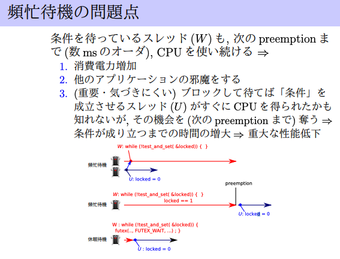
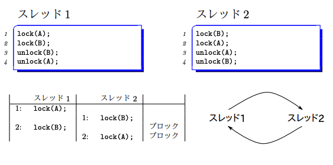
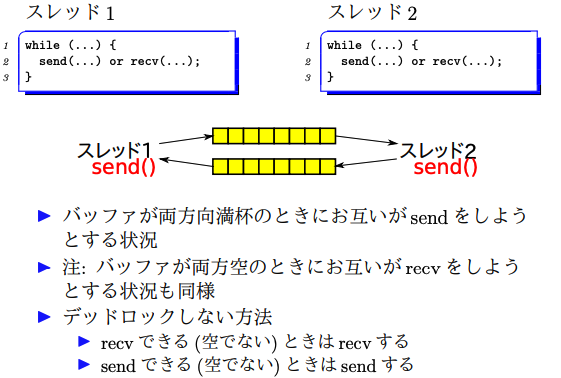

# 並行処理と同期

## 共有メモリと競合状態
### 例
同一プロセス内のスレッドはメモリを共有している。

競合する例: 2 child threads

片方のg += 100 の間にもう一方のスレッドによりgが書き換えられていなければ成功する。
なぜ？: CPUが一度に行えるメモリに対する操作はread, writeどちらかだけである。
```c
int g = 0; // global

void *f(void *arg) {
    g += 100;
    return 0;
}

int main() {
    int err;
    g = 200;
    /* スレッドを作る */
    pthread_t child_thread_id[2];
    for (int i = 0; i < 2; i++)
        pthread_create(&child_thread_id[i], 0, f, 0);
    /* 終了待ち */
    for (int i = 0; i < 2; i++) {
        void * ret = 0;
        pthread_join(child_thread_id[i], &ret);
    }
    printf("g = %d\n", g);
    return 0;
}
```

### 用語の定義
定義: 競合状態とは以下のような状態
- 複数スレッドが
    - (a) 同じ場所を
    - (b) 並行してアクセスしていて
- うち少なくとも１つは書き込みである

定義: 際どい領域 Critical Section
- コード上で競合状態が発生している領域

### 競合状態の分類
- 不可分性(Atomicity)の崩れ
    - 一度にできない一連の操作の途中に他のUpdate処理が挟まるために、意図しない動作になる
- 順序・依存関係(Dependency)の崩れ
    - 複数スレッド間で、Read/Writeの順序保証をする必要がある処理なのに、その保証ができない場合にダメになる。

## 同期 (Synchronization)
### 排他制御 `mutex`
1人しか入れない個室トイレ
- `lock`: トイレが空いてれば入って鍵をかける。空いてなければ空くまで待つ
- `unlock`: 鍵を空けてトイレを空ける。
Atomicに行いたい処理をlock/unlockで挟む

#### API
API: [man page](https://linuxjm.osdn.jp/html/LDP_man-pages/man7/pthreads.7.html)
```c
#include <pthread.h>

pthread_mutex_t m; /* 排他制御オブジェクト */
pthread_mutex_init(&m, attr);
pthread_mutex_destroy(&m);
pthread_mutex_lock(&m); /* lock */
pthread_mutex_try_lock(&m);
pthread_mutex_unlock(&m); /* unlock */
```


#### 例: スレッドセーフなIncrement Counter
```c
typedef struct {
  long n;
  pthread_mutex_t mutex;
} counter_t;

void counter_init(counter_t* c) {
  c->n = 0;
  pthread_mutex_init(&c->mutex, NULL);
  return;
}

long counter_inc(counter_t* c) {
  long ret;
  pthread_mutex_lock(&c->mutex);
  ret = c->n;
  (c->n)++;
  pthread_mutex_unlock(&c->mutex);
  return ret;
}

long counter_get(counter_t* c) {
  long ret;
  pthread_mutex_lock(&c->mutex);
  ret = c->n;
  pthread_mutex_unlock(&c->mutex);
  return ret;
}
```

### バリア同期 `barrier`
```c
#include <pthread.h>
pthread_barrier_t b; /* バリアオブジェクト */
pthread_barrier_init(&b, attr, count);
/* count=参加するスレッド数 */
pthread_barrier_destroy(&b);
pthread_barrier_wait(&b);
/* 同期点に到達; 他のスレッドを待つ */
```


### 条件変数 `cond`
ある条件が整うまで待つ、待っているスレッドを叩き起こす汎用機構。布団。

```c
#include <pthread.h>
pthread_cond_t c;
pthread_mutex_t m;

pthread_cond_init(&c, attr);
pthread_cond_destroy(&c);
pthread_cond_wait(&c, &m); /* 寝る */
pthread_cond_broadcast(&c); /* 全員起こす */
pthread_cond_signal(&c); /* 誰か一人起こす */
```

#### `pthread_cond_wait(&c, &m)`の動作
- `pthread_cond_wait`を呼び出した時点でスレッドはmをLockしている。
    - mをunlockする
    - cの上で寝る (中断・ブロック)
を**不可分に**行う。
    - returnする際にはまたmをLockしていることが保証


#### 例: 飽和付きカウンタ (os07)
```c
/* 注: このプログラムはOMP_NUM_THREADSを使わずにコマンドラインで受け取った引数でスレッド数を決めている(#pragma omp parallel num_threads(...)) */

#include <assert.h>
#include <stdio.h>
#include <stdlib.h>
#include <pthread.h>
#include <omp.h>

/* 飽和カウンタ */
typedef struct {
  long x;
  long capacity;
  pthread_mutex_t m[1];
  pthread_cond_t c[1];
  pthread_cond_t d[1];
} scounter_t;

/* 初期化(値を0にする) */
void scounter_init(scounter_t * s, long capacity) {
  s->x = 0;
  s->capacity = capacity;
  if (pthread_mutex_init(s->m, 0)) {
    die("pthread_mutex_init");
  }
  if (pthread_cond_init(s->c, 0)) {
    die("pthread_cond_init");
  }
  if (pthread_cond_init(s->d, 0)) {
    die("pthread_cond_init");
  }
}

/* +1 ただしcapacityに達していたら待つ */
long scounter_inc(scounter_t * s) {
  pthread_mutex_lock(s->m);
  long x = s->x;
  // capacityに達していたらwait
  while (x >= s->capacity) {
    assert(x == s->capacity);
    pthread_cond_wait(s->c, s->m);
    x = s->x;
  }
  // 飽和が解消されたので
  s->x = x + 1; // increment
  // この操作によってEmptyが解消されたら、下限condに寝てるThreadを起こす
  if (x <= 0) {
    assert(x == 0);
    pthread_cond_broadcast(s->d);
  }
  pthread_mutex_unlock(s->m);
  assert(x < s->capacity);
  return x;
}

/* -1 */
long scounter_dec(scounter_t * s) {
  pthread_mutex_lock(s->m);
  long x = s->x;
  // emptyだったらwait
  while (x <= 0) {
    assert(x == 0);
    pthread_cond_wait(s->d, s->m);
    x = s->x;
  }
  // emptyが解消されたので
  s->x = x - 1; // decrement
  // この操作によって飽和が解消されたら、上限condで寝てるThreadを起こす
  if (x >= s->capacity) {
    assert(x == s->capacity);
    pthread_cond_broadcast(s->c);
  }
  pthread_mutex_unlock(s->m);
  return x;
}

/* 現在の値を返す */
long scounter_get(scounter_t * s) {
  return s->x;
}
```

#### 条件変数使い方テンプレ
ある条件Cが成り立つまで待って、Aをする、という場合
```c
pthread_mutex_lock(&m);
while (1) {
    C = ...; /* 条件評価 */
    if (C) break;
    pthread_cond_wait(&c, &m);
}
/* C が成り立っているのでここで何かをする */
A
/* 寝ている誰かを起こせそうなら起こす */
...
pthread_mutex_unlock(&m);
```

#### pthread_cond_waitがmutexも引数にとる理由
- 条件判定時、そのThreadはmutexをlockしているはず。
- 自分が処理をブロックしてwaitする際は、他のThreadにMutexを開けわたさないといけない。
- mのunlockと自分の休眠を不可分に行う必要がある(Lost wake up問題への対処)

## 不可分更新命令
1変数に対するRead/Writeを不可分に行ういくつかの命令がある
- adhocな命令
    - test&set p (0だったら1にする)
    ```c
    if (*p == 0) {
        *p = 1; return 1;
    } else {
        return 0;
    }
    ```
    - fetch&add p, x
    ```c
    *p = *p + x;
    ```
    - swap p, r
    ```c
    x = *p;
    *p = r;
    r = x;
    ```
- 汎用命令
    - compare&swap: 自分が読んだ値が書きかわっていないことを確かめながら不可分に書き込む
    ```c
    x = *p;
    if (x == r) {
        *p = s;
        s = x;
    }
    ```
    - `bool __sync_bool_compare_and_swap(type *p, type r, type s)`
        - swapが起きたかどうかを返す
    - `type __sync_val_compare_and_swap(type *p, type r, type s)`
        - `*p`に入っていた値を返す

### CASテンプレ
`*p = f(*p)`という更新を不可分に
```c
while (1) {
    x = *p;
    y = f(x);
    if (__sync_bool_compare_and_swap(p, x, y)) break;
}
```

## 同期の実装
- ナイーブな発想
```c
// NG例
int lock(mutex_t *m) {
    while (1) {
        if (m->locked == 0) { // 評価(競合)
            m->locked = 1; // 更新(競合)
            break;
        } else {
            BLOCK
        }
    }
}
```

- 不可分更新命令を使う & `futex`を使う
```c
// OK
int lock(mutex_t * m) {
    while (!test_and_set(&m->locked)) {
        /* m->locked == 1 だったらブロック */
        futex(&m->locked, FUTEX WAIT, 1, 0, 0, 0);
    }
}
int unlock(mutex_t * m) {
    m->locked = 0;
    futex(&m->locked, FUTEX_WAKE, 1, 0, 0, 0);
}
```

### `futex`
`if(u==v) then block`を不可分に実行
```c
futex(&u, FUTEX_WAIT, v, 0, 0, 0);
```
参照: [man futex](https://linuxjm.osdn.jp/html/LDP_man-pages/man2/futex.2.html)

### 休眠待機　vs 繁忙待機
- 休眠待機 (blocking wait)
    - `futex`, `cond_wait`などで待つ
    - OSに「CPUを割り当てなくて良い」とわかるように待つ
- 繁忙待機
    - `while(!condition) { 何もしない }`
    - OSに「CPUを割り当てなくて良い」ことがわからないように待つ(実行可能であり続ける)
例はスライド04 p60-65あたり参照



- 基本は使わないが、全てのスレッドが同時に実行されている想定のときは高速化できるかも。多数のスレッドが中断・復帰するときには有効。

### スピンロック
mutexの繁忙待機バージョン
`pthread_spinlock_*`

### futex自体の実装(advanced)
スライド参照。。

### デッドロック
同期のための待機状態が循環し、どのスレッド・プロセスも永遠にブロックしたままになる状態
Example
- 二つ以上の排他制御

- 送受信バッファ


回避方法
- 問題の根源は「誰かを待たせながら誰かを待つ」こと。これがダメ。
- mutexを一つだけにする (giant lock)
- 1つのスレッドは2つのMutexを同時にLockしない。
- 全てのmutexに順序をつけ、全てのスレッドはその全順序の順でしかLockをしない
- 不可分更新をするのに排他制御を使わない
    - 不可分更新
    - トランザクショナルメモリ
